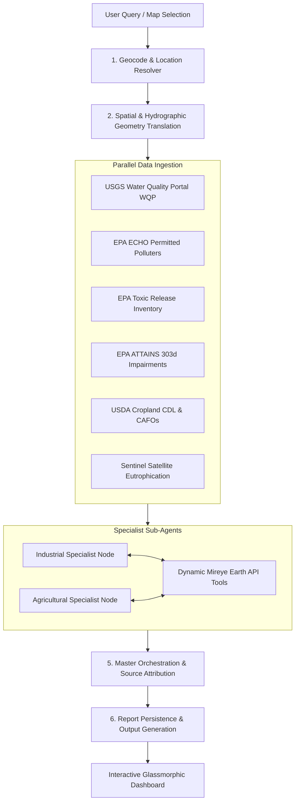

# 🌊 AquaTrace — Agentic Waterbody Pollution Assessment & Source Attribution Platform

AquaTrace is an advanced **Multi-Agent AI Platform (MoA)** for autonomous water quality assessment, hydrographic corridor tracing, point/non-point source pollution diagnostic reasoning, and spatial risk analysis for any river corridor, lake, pond, or bay in the United States.

It combines live federal environmental databases (**EPA ECHO**, **EPA TRI**, **EPA ATTAINS**, **USGS WQP**, **USGS NHD**), satellite remote sensing (**Sentinel Eutrophication Index**, **USDA Cropland CDL**), and **Mireye Earth API** spatial intelligence with an autonomous **LangGraph Multi-Agent Architecture**.

---

## 🌟 Key Capabilities

- 🤖 **Multi-Agent Orchestration Architecture (MoA)**:
  - **Industrial Pollution Specialist Agent**: Analyzes point-source NPDES effluent violations, outfall discharge channels, and EPA TRI toxic chemical releases.
  - **Agricultural Runoff Specialist Agent**: Assesses non-point source nutrient loading, USDA Cropland ratios, CAFO manure risk, and satellite algal bloom eutrophication indices.
  - **Master Synthesis Orchestrator Agent**: Synthesizes specialist evidence to perform legal EPA CWA Section 303(d) impairment attribution and assign overall Environmental Risk Ratings (A–F).
- 🛰️ **Dynamic Autonomous Mireye Earth API Tools**:
  - Sub-agents possess dynamic authority to query Mireye Earth API tools (`query_mireye_fetch`, `query_mireye_ask`, `get_mireye_land_risk`) autonomously based on diagnostic relevance.
  - Full Mireye catalog support: `utilities`, `points_of_interest`, `land_cover`, `terrain`, `natural_hazard`, `boundaries`, `flood_risk`.
- 🗺️ **Authoritative Hydrography & Polygon Tracing**:
  - **Lotic Waterbodies (Rivers/Streams)**: Stitches continuous USGS NHD flowlines along Point A ➔ Point B waterbody corridors.
  - **Lentic Waterbodies (Lakes/Ponds/Reservoirs)**: Multi-Tier Authoritative Polygon Retrieval Engine querying **USGS NHD MapServer Layer 12/10** and **OSM Nominatim** for exact 100% real-world shoreline contours (e.g. Utah Lake 4,778-point geometry) with intelligent vector subsampling for instant 60fps Leaflet map rendering.
- 🎨 **Modern Radiant Oceanic UI**:
  - Glassmorphic translucent dark-blue cards, glowing cyan borders, interactive Leaflet map controls, custom corridor selector modals, crash-proof React `ErrorBoundary`, and real-time execution audit logs.

---

## 🛠️ How It Works (Pipeline Architecture)

AquaTrace executes a structured multi-agent state graph built on **LangGraph**:



### Execution Flow:

1. **Location Resolution (`GeocodeNode`)**: Resolves waterbody names or map coordinates to exact bounding boxes and centromeres.
2. **Hydrographic Tracing (`SpatialTranslationNode`)**: Queries USGS NHD and OSM APIs to extract exact river flowlines or lake polygon shoreline rings.
3. **Data Ingestion**: Concurrently queries live USGS WQP chemistry samples, EPA ECHO facilities, EPA TRI chemical discharges, EPA ATTAINS impairment records, USDA CDL cropland metrics, and Sentinel satellite algal bloom indices.
4. **MoA Specialist Reasoning**:
   - `IndustrialSpecialistNode` and `AgriculturalSpecialistNode` evaluate candidate pollution vectors.
   - Each specialist autonomously invokes Mireye Earth API tools to verify outfalls, land cover, terrain erodibility, or nearby manufacturing POIs if needed.
5. **Master Synthesis (`MasterOrchestrationNode`)**: Merges evidence, assigns risk ratings (0–100, A–F), formulates chemical signature matches, and attributes primary pollution sources.
6. **Persistence & UI Render**: Saves structured reports (`backend/data/outputs/`) and streams real-time updates to the Vite/React UI.

---

## 📁 Repository Structure

```text
mireye project/
├── backend/
│   ├── app/
│   │   ├── agent/
│   │   │   ├── nodes/
│   │   │   │   ├── industrial_specialist_node.py  # NPDES & point-source specialist
│   │   │   │   ├── agricultural_specialist_node.py # Runoff & non-point specialist
│   │   │   │   ├── master_orchestration_node.py   # Synthesis & attribution orchestrator
│   │   │   │   ├── geocode_node.py                # Location resolver
│   │   │   │   ├── spatial_translation_node.py    # Hydrography & geometry engine
│   │   │   │   └── persist_node.py                # Data persistence
│   │   │   ├── graph.py                           # LangGraph state machine workflow
│   │   │   └── state.py                           # Pydantic assessment state schema
│   │   ├── tools/
│   │   │   ├── usgs_nldi_tool.py                  # USGS NHD & polygon boundary engine
│   │   │   ├── mireye_dynamic_tool.py             # Mireye Earth API dynamic tools
│   │   │   ├── mireye_land_risk_tool.py            # Mireye terrain risk tool
│   │   │   ├── epa_echo_tool.py                   # EPA ECHO polluter registry
│   │   │   ├── epa_tri_tool.py                    # EPA Toxic Release Inventory
│   │   │   ├── epa_wqp_tool.py                    # USGS Water Quality Portal
│   │   │   ├── epa_attains_tool.py                # EPA CWA 303(d) impairment records
│   │   │   ├── usda_cropscape_tool.py             # USDA CDL cropland & CAFO tool
│   │   │   └── sentinel_eutrophication_tool.py    # Satellite algal bloom index tool
│   │   ├── api/                                   # FastAPI REST endpoints
│   │   ├── core/                                  # Logging & exceptions
│   │   └── config.py                              # App environment configuration
│   └── tests/                                     # Pytest automated test suites
├── frontend/
│   ├── src/
│   │   ├── components/
│   │   │   ├── MapView/                           # Leaflet map, markers & overlays
│   │   │   ├── ResultsPanel/                      # MoA cards, diagnosis & attribution
│   │   │   ├── DataSourcesPanel/                  # Live JSON payload audit cards
│   │   │   ├── SearchBar/                         # Waterbody corridor search
│   │   │   ├── MapSelectorModal/                  # Point A -> Point B corridor selector
│   │   │   └── ErrorBoundary.tsx                  # React crash boundary
│   │   ├── pages/
│   │   │   └── AssessmentPage.tsx                 # Main assessment dashboard
│   │   └── styles/
│   │       └── global.css                         # Radiant oceanic glassmorphic styling
│   └── package.json
└── README.md
```

---

## ⚡ Prerequisites & Setup

### Prerequisites
- **Python**: `3.11` or higher
- **Node.js**: `18.0` or higher & `npm`

---

### 1. Environment Configuration

Create `.env` files in both `backend` and `frontend` directories using `.env.example`:

**`backend/.env`**:
```ini
PROJECT_NAME="AquaTrace Backend"
PORT=8000
OPENAI_API_KEY="your-openai-api-key"
OPENAI_MODEL="gpt-4o"
MIREYE_API_KEY="your-mireye-api-key"
MIREYE_API_URL="https://api.mireye.earth/v1"
```

**`frontend/.env`**:
```ini
VITE_API_BASE_URL="http://localhost:8000"
```

---

### 2. Running the Backend API

```bash
cd backend

# Create and activate virtual environment
python -m venv .venv
# On Windows:
.venv\Scripts\activate
# On macOS/Linux:
# source .venv/bin/activate

# Install dependencies
pip install -r requirements.txt

# Start FastAPI dev server
uvicorn app.main:app --reload --host 0.0.0.0 --port 8000
```
*Backend server will run at `http://localhost:8000` (Swagger docs at `http://localhost:8000/docs`).*

---

### 3. Running the Frontend App

```bash
cd frontend

# Install dependencies
npm install

# Start Vite dev server
npm run dev
```
*Frontend UI will run at `http://localhost:5173`.*

---

### 4. Running Automated Tests

```bash
# Backend pytest suite
cd backend
pytest

# Frontend TypeScript check
cd frontend
npm run lint
```

---

## 📡 REST API Specifications

| Method | Endpoint | Description |
| :--- | :--- | :--- |
| `POST` | `/api/v1/assessments` | Initiate background waterbody assessment (`{ "query": "Utah Lake" }` or corridor points). |
| `GET` | `/api/v1/assessments/{run_id}` | Poll assessment execution status (`pending`, `completed`, `failed`). |
| `GET` | `/api/v1/assessments/{run_id}/result` | Retrieve full structured JSON assessment report. |

---

## 📜 License

Distributed under the MIT License. See `LICENSE` for more information.
