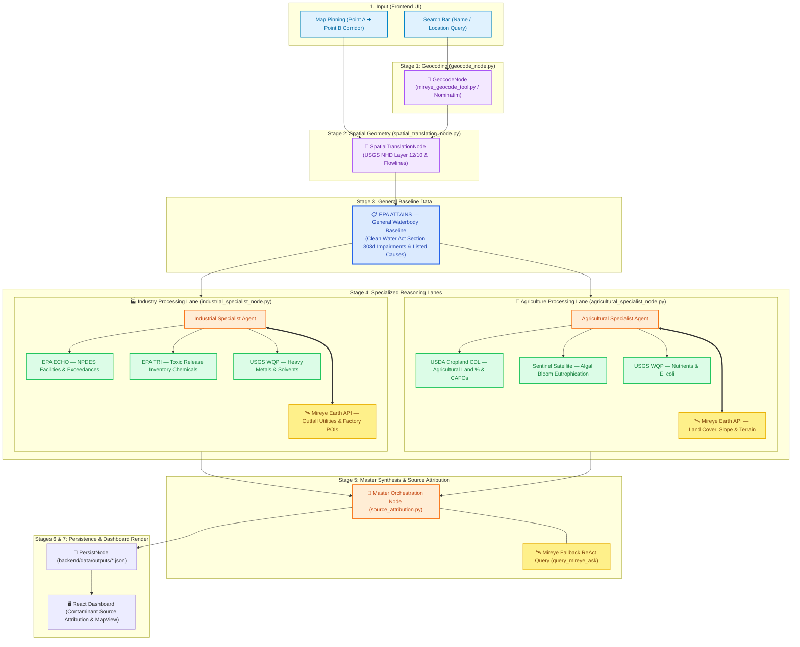

# 🏗️ AquaTrace — Complete System Architecture & Node Code Flow Specification

This document provides a detailed technical breakdown of every execution node, data pipeline stage, sub-agent interaction, and hydrographic tool within the **AquaTrace Multi-Agent Platform**.

---

## 📐 Overall Graph Execution Flowchart



---

## 🔍 Detailed Breakdown of Every Node & Code Component

### 1. `GeocodeNode` (`backend/app/agent/nodes/geocode_node.py`)
- **Purpose**: Converts user input (text queries like `"Utah Lake"` or custom Point A ➔ Point B map selections) into standardized geospatial location metadata.
- **Inputs**: `state.query`, `state.start_point`, `state.end_point`.
- **Mireye Integration**: **🛰️ MIREYE CALL 1 (Initial Geocoding Lookup)**: Queries `mireye_geocode_tool.py` (`geocode_waterbody`) and OpenStreetMap Nominatim REST API.
- **Outputs**:
  - `state.resolved_location`: `{ "lat": float, "lng": float, "display_name": str }`.
  - `state.hydrology["bbox"]`: Extended bounding box `[min_lng, min_lat, max_lng, max_lat]`.

---

### 2. `SpatialTranslationNode` (`backend/app/agent/nodes/spatial_translation_node.py`)
- **Purpose**: Generates high-accuracy hydrographic geometries for both river corridors and lake/pond waterbodies.
- **Inputs**: `state.resolved_location`, `state.hydrology["bbox"]`, `waterbody_type`.
- **Tools Invoked**: `usgs_nldi_tool.py` (`fetch_nhd_waterbody`, `fetch_river_segment_flowline`, `fetch_overpass_polygon_geometry`).
- **Detailed Geometry Logic**:
  - **Lotic Waterbodies (Rivers/Streams)**: Stitches continuous USGS NHD flowlines along Point A ➔ Point B.
  - **Lentic Waterbodies (Lakes/Ponds/Reservoirs)**: Multi-Tier Authoritative Polygon Engine:
    - *Tier 1*: Queries **USGS NHD MapServer Layer 12/10** (`NHDWaterbody`) for exact 100% real-world polygon boundaries (e.g., 4,778-point polygon for Utah Lake).
    - *Tier 2*: Queries **OSM Nominatim** (`polygon_geojson=1`).
    - *Tier 3*: Assembles OSM Overpass relations and ways.
    - *Subsampling*: Runs `subsample_polygon_ring(coords, max_points=450)` to ensure lag-free 60fps Leaflet vector rendering.
- **Outputs**:
  - `state.hydrology["flowline_geojson"]`: GeoJSON FeatureCollection (LineString or Polygon).
  - `state.hydrology["_bank_points"]`: Riverbank sampling points for land risk evaluation.

---

### 3. General Baseline Data Layer — EPA ATTAINS (`epa_attains_tool.py`)
- **Purpose**: Establishes the authoritative Clean Water Act Section 303(d) baseline waterbody impairment status, listed causes (e.g. Arsenic, Sediment, Nutrients), affected designated uses, and TMDL requirements.
- **Role in Workflow**: Functions as the primary general data entry point that feeds downstream specialized reasoning lanes.

---

### 4A. Industry Processing Lane — `IndustrialSpecialistNode` (`industrial_specialist_node.py`)
- **Purpose**: Specialized reasoning lane for point-source industrial pollution, NPDES outfall violations, and toxic chemical releases.
- **Datasets & Tools Consumed**:
  - **EPA ECHO Tool** (`epa_echo_tool.py`): NPDES Permitted Industrial Facilities & Effluent Violations
  - **EPA TRI Tool** (`epa_tri_tool.py`): Toxic Release Inventory Chemical Release Volumes
  - **USGS WQP Chemistry**: Filtered Industrial Water Samples (Lead, Arsenic, Cadmium, Mercury, Benzene, Toluene, pH)
  - **Mireye Earth API** (`query_mireye_fetch`, `query_mireye_ask`): `utilities` (Outfall channels), `points_of_interest` (Chemical & Manufacturing POIs)
- **Dynamic Execution**: Possesses **autonomous authority** to execute multi-turn tool calls (up to 4 turns) based on diagnostic relevance.
- **Outputs**: `state.industrial_analysis`.

---

### 4B. Agriculture Processing Lane — `AgriculturalSpecialistNode` (`agricultural_specialist_node.py`)
- **Purpose**: Specialized reasoning lane for non-point source agricultural runoff, fertilizer intensity, CAFO manure loading, and algal blooms.
- **Datasets & Tools Consumed**:
  - **USDA Cropland CDL Tool** (`usda_cropscape_tool.py`): Agricultural Land %, Crop Breakdown & CAFO Lagoons
  - **Sentinel Satellite Tool** (`sentinel_eutrophication_tool.py`): Algal Bloom Chlorophyll-a Eutrophication Index
  - **Mireye Land Risk Tool** (`mireye_land_risk_tool.py`): Riverbank Slope, Tree Canopy %, Soil Erodibility K-Factor
  - **USGS WQP Chemistry**: Filtered Agricultural Nutrient Samples (Nitrates, Phosphates, Ammonia, E. coli)
  - **Mireye Earth API** (`query_mireye_fetch`, `query_mireye_ask`): `land_cover`, `terrain`, manure lagoons
- **Dynamic Execution**: Possesses **autonomous authority** to execute multi-turn tool calls (up to 4 turns) based on diagnostic relevance.
- **Outputs**: `state.agricultural_analysis`.

---

### 5. `MasterOrchestrationNode` (`backend/app/agent/nodes/master_orchestration_node.py`)
- **Purpose**: Master MoA Orchestrator that synthesizes outputs from both specialized reasoning lanes into a unified Master Synthesis (`master_synthesis`).
- **Mireye Integration**: **🛰️ MIREYE CALL 5 (Fallback ReAct Reasoning Query)**: Executes `query_mireye_ask` inside `source_attribution.py` if remaining uncertainty requires natural language spatial reasoning.
- **Outputs**: `state.master_synthesis` (Overall Risk Score 0–100, Grade A–F, primary polluter category, EPA CWA 303d legal attribution).

---

### 6. `PersistNode` (`backend/app/agent/nodes/persist_node.py`)
- **Purpose**: Saves the complete, structured assessment report to local disk storage (`backend/data/outputs/assessment_<run_id>.json`) and feeds the Vite/React interactive UI dashboard.

---

## 🔄 Complete Execution Data Flow Summary (General Baseline ➔ Industry & Agriculture Lanes)

```text
User Request / Coordinates Selection
       │
       ▼
[Stage 1: GeocodeNode] ──► 🛰️ MIREYE CALL 1: Initial Geocoding Lookup (mireye_geocode_tool.py / Nominatim)
       │                    └─► Converts waterbody name/query ➔ Lat/Lng & Bounding Box
       ▼
[Stage 2: SpatialTranslationNode] ──► Hydrography Tracing & Polygon Engine
       │                            ├─► USGS NHD Layer 12/10 Waterbody Polygons (e.g. Utah Lake 4,778 pts)
       │                            └─► Extracts Riverbank Sampling Points (_bank_points)
       ▼
[Stage 3: EPA ATTAINS General Data] ──► Baseline CWA Section 303(d) Waterbody Impairments & Listed Causes
       │
       ├────────────────────────────────────────────────────────────────────────┐
       ▼                                                                        ▼
[Industry Processing Lane (Stage 4A)]                  [Agriculture Processing Lane (Stage 4B)]
  (industrial_specialist_node.py)                         (agricultural_specialist_node.py)
  │                                                        │
  ├─► EPA ECHO (Permitted Facilities & Exceedances)        ├─► USDA Cropland CDL (Agricultural Land % & CAFOs)
  ├─► EPA TRI (Toxic Release Inventory Chemicals)         ├─► Sentinel Satellite (Algal Bloom Eutrophication)
  ├─► USGS WQP (Heavy Metals, Solvents & pH)              ├─► USGS WQP (Nutrients: Nitrates, Phosphates, E. coli)
  └─► 🛰️ MIREYE DYNAMIC EARTH TOOLS (AUTONOMOUS)           └─► 🛰️ MIREYE DYNAMIC EARTH TOOLS (AUTONOMOUS)
       ├─► query_mireye_fetch(preset='utilities')              ├─► query_mireye_fetch(preset='land_cover')
       ├─► query_mireye_fetch(preset='points_of_interest')     ├─► query_mireye_fetch(preset='terrain')
       └─► query_mireye_ask() [Multi-turn, up to 4 turns]      └─► query_mireye_ask() [Multi-turn, up to 4 turns]
  │                                                        │
  └────────────────────────────────────────────────────────┴────────────────────┘
       │
       ▼
[Stage 5: MasterOrchestrationNode] ──► Synthesizes Evidence Across Lanes & Performs Source Attribution
       │                                └─► 🛰️ MIREYE CALL 5: Fallback ReAct Reasoning (query_mireye_ask)
       ▼
[Stage 6: PersistNode] ──► Save JSON Report (backend/data/outputs/assessment_<run_id>.json)
       │
       ▼
[Interactive Dashboard UI] ──► Contaminant-Centric Source Attribution Cards & Leaflet Map
```
