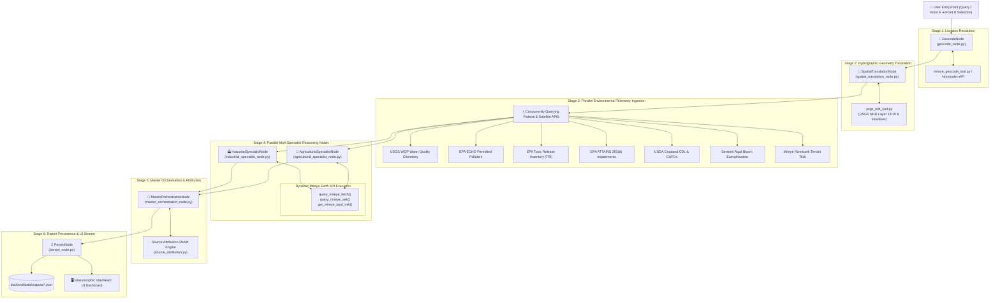

# 🏗️ AquaTrace — Complete System Architecture & Node Code Flow Specification

This document provides a detailed technical breakdown of every execution node, data pipeline stage, sub-agent interaction, and hydrographic tool within the **AquaTrace Multi-Agent Platform**.

---

## 📐 Overall Graph Execution Flowchart



---

## 🔍 Detailed Breakdown of Every Node & Code Component

### 1. `GeocodeNode` (`backend/app/agent/nodes/geocode_node.py`)
- **Purpose**: Converts user input (e.g. `"Potomac River near Great Falls"` or latitude/longitude coordinates) into standardized geospatial location metadata.
- **Inputs**: `state.query`, `state.start_point`, `state.end_point`.
- **Tools Invoked**: `mireye_geocode_tool.py`, OpenStreetMap Nominatim REST API.
- **Outputs**:
  - `state.resolved_location`: `{ "lat": float, "lng": float, "display_name": str }`.
  - `state.hydrology["bbox"]`: Extended bounding box `[min_lng, min_lat, max_lng, max_lat]`.
- **Code Logic**:
  ```python
  if state.start_point and state.end_point:
      # Segment Corridor mode
      bbox = [
          min(start_lng, end_lng) - 0.05, min(start_lat, end_lat) - 0.05,
          max(start_lng, end_lng) + 0.05, max(start_lat, end_lat) + 0.05
      ]
  else:
      # Text query geocoding
      resolved = await geocode_waterbody.ainvoke({"query": state.query})
  ```

---

### 2. `SpatialTranslationNode` (`backend/app/agent/nodes/spatial_translation_node.py`)
- **Purpose**: Generates high-accuracy hydrographic geometries for both river corridors and lake/pond waterbodies.
- **Inputs**: `state.resolved_location`, `state.hydrology["bbox"]`, `waterbody_type`.
- **Tools Invoked**: `usgs_nldi_tool.py` (`fetch_nhd_waterbody`, `fetch_river_segment_flowline`, `fetch_overpass_polygon_geometry`).
- **Detailed Geometry Logic**:
  - **Lotic Waterbodies (Rivers/Streams)**: Stitches continuous USGS NHD flowlines along Point A ➔ Point B.
  - **Lentic Waterbodies (Lakes/Ponds/Reservoirs)**: Multi-Tier Authoritative Polygon Engine:
    - *Tier 1*: Queries **USGS NHD MapServer Layer 12/10** (`NHDWaterbody`) for exact 100% real-world polygon boundaries (e.g., 4,778-point polygon for Utah Lake).
    - *Tier 2*: Queries **OSM Nominatim** (`polygon_geojson=1`).
    - *Tier 3*: Assembles OSM Overpass relations and ways.
    - *Subsampling*: Runs `subsample_polygon_ring(coords, max_points=450)` to ensure lag-free 60fps Leaflet vector rendering.
- **Outputs**:
  - `state.hydrology["flowline_geojson"]`: GeoJSON FeatureCollection (LineString or Polygon).
  - `state.hydrology["_bank_points"]`: Riverbank sampling points for land risk evaluation.

---

### 3. Telemetry & Data Ingestion Layer (Concurrent Pipeline)
- **Purpose**: Concurrently fetches live environmental data across federal registries, satellite remote sensing, and Mireye spatial APIs.
- **Data Ingestion Components**:
  - `get_epa_water_quality` (`epa_wqp_tool.py`): Queries USGS Water Quality Portal for heavy metals, solvents, nutrients, pH, dissolved oxygen, and turbidity.
  - `get_epa_echo_polluters` (`epa_echo_tool.py`): Queries EPA ECHO NPDES permitted industrial facilities, effluent exceedance counts, and quarters in noncompliance.
  - `get_epa_tri_releases` (`epa_tri_tool.py`): Queries EPA Toxic Release Inventory (TRI) for chemical volumes (lead, arsenic, benzene, toluene).
  - `get_epa_attains_status` (`epa_attains_tool.py`): Queries EPA CWA Section 303(d) waterbody impairment records, cause names, and TMDL status.
  - `get_usda_cropland_data` (`usda_cropscape_tool.py`): USDA CDL agricultural cropland %, crop breakdown (corn/soy/wheat), fertilizer intensity, CAFO manure lagoons.
  - `get_sentinel_eutrophication_index` (`sentinel_eutrophication_tool.py`): Satellite remote sensing Chlorophyll-a & algal bloom index.
  - `get_mireye_land_risk` (`mireye_land_risk_tool.py`): Mireye terrain bank slope, tree canopy %, NDVI 5-year change, soil erodibility (K-factor).

---

### 4A. `IndustrialSpecialistNode` (`backend/app/agent/nodes/industrial_specialist_node.py`)
- **Purpose**: Autonomous sub-agent specializing in point-source industrial pollution, NPDES outfall violations, and toxic chemical releases.
- **Dynamic Mireye Integration**:
  - Bound tools: `[query_mireye_fetch, query_mireye_ask, get_mireye_land_risk]`.
  - System prompt includes the full Mireye Data Catalog (`utilities`, `points_of_interest`, `land_cover`, `terrain`, `boundaries`, `natural_hazard`, `flood_risk`).
  - Possesses **autonomous authority** to execute multi-turn tool calls (up to 4 turns) based on diagnostic relevance.
- **Outputs**: `state.industrial_analysis`:
  ```json
  {
    "risk_score": 75,
    "risk_rating": "D",
    "high_risk_facilities": [...],
    "chemical_signature_match": "NPDES Industrial Effluent Match",
    "evidence_summary": "Audited 4 NPDES permitted facilities and 2 TRI chemical release sites...",
    "npdes_violations_summary": { "total_exceedances": 8, "noncompliance_quarters": 4 },
    "tri_releases_summary": { "sites_found": 2, "releases": [...] }
  }
  ```

---

### 4B. `AgriculturalSpecialistNode` (`backend/app/agent/nodes/agricultural_specialist_node.py`)
- **Purpose**: Autonomous sub-agent specializing in non-point source agricultural runoff, fertilizer intensity, CAFO manure loading, and algal blooms.
- **Dynamic Mireye Integration**:
  - Bound tools: `[query_mireye_fetch, query_mireye_ask, get_mireye_land_risk]`.
  - System prompt includes full Mireye Data Catalog for agricultural cropland %, NDVI vegetation index, soil erodibility K-factor, and manure storage lagoons.
  - Multi-turn autonomous tool execution loop (up to 4 turns).
- **Outputs**: `state.agricultural_analysis`:
  ```json
  {
    "risk_score": 60,
    "risk_rating": "C",
    "crop_coverage": { "agricultural_land_pct": 52.5, "fertilizer_intensity": "HIGH" },
    "cafos_in_watershed": [...],
    "eutrophication_index": { "algal_bloom_detected": true, "chlorophyll_a_ug_l": 28.4 },
    "nutrient_signature_match": "High Nitrate / Synthetic Fertilizer Runoff",
    "evidence_summary": "Analyzed 52.5% agricultural land cover and satellite algal bloom indicators..."
  }
  ```

---

### 5. `MasterOrchestrationNode` (`backend/app/agent/nodes/master_orchestration_node.py`)
- **Purpose**: Master MoA Orchestrator that synthesizes outputs from both specialist agents into a unified Master Synthesis (`master_synthesis`).
- **Inputs**: `state.industrial_analysis`, `state.agricultural_analysis`, `state.attains_status`, `state.water_quality_samples`.
- **Reasoning Process**:
  1. Resolves conflicting hypotheses between point-source industrial outfalls and non-point agricultural runoff.
  2. Synthesizes overall Environmental Assessment Risk Rating (0–100 score, A–F grade).
  3. Formulates EPA CWA Section 303(d) impairment attribution and legal compliance recommendations.
- **Outputs**: `state.master_synthesis`:
  ```json
  {
    "overall_risk_score": 68,
    "overall_risk_rating": "D",
    "primary_polluter_category": "Point Source Industrial Effluent & Agricultural Runoff",
    "attribution_confidence": "HIGH",
    "conflict_resolution_notes": "Industrial outfall exceedances match measured heavy metal concentrations...",
    "legal_attains_compliance_summary": "Exceeds CWA Section 303(d) nutrient & heavy metal criteria...",
    "recommended_remediation_actions": ["Audit NPDES outfall pipeline #2", "Install riparian buffer strips"]
  }
  ```

---

### 6. `PersistNode` (`backend/app/agent/nodes/persist_node.py`)
- **Purpose**: Saves the complete, structured assessment report to local disk storage and finalizes state execution.
- **File Output Path**: `backend/data/outputs/assessment_<run_id>.json`.
- **Frontend Sync**: Exposes JSON report for immediate consumption by the Vite/React UI dashboard (`AssessmentPage.tsx`, `MoAAnalysisCards.tsx`, `PollutionDiagnosisCard.tsx`).

---

## 🔄 Complete Execution Data Flow Summary

```text
User Request / Coordinates Selection
       │
       ▼
[Stage 1: GeocodeNode] ──► Resolves Lat/Lng & Bounding Box
       │
       ▼
[Stage 2: SpatialTranslationNode] ──► Multi-Tier USGS NHD Layer 12/10 Polygon Tracing
       │
       ▼
[Stage 3: Telemetry Ingestion Layer] (WQP + ECHO + TRI + ATTAINS + USDA CDL + Sentinel)
       │
       ├─────────────────────────────────────────┐
       ▼                                         ▼
[Stage 4A: IndustrialSpecialistNode]    [Stage 4B: AgriculturalSpecialistNode]
  └─► Dynamic Mireye Earth Tools          └─► Dynamic Mireye Earth Tools
       │                                         │
       └─────────────────────────────────────────┘
       │
       ▼
[Stage 5: MasterOrchestrationNode] ──► Master Synthesis & Legal CWA Attribution
       │
       ▼
[Stage 6: PersistNode] ──► Save JSON Report (backend/data/outputs/)
       │
       ▼
[Interactive Dashboard UI] ──► 60fps Leaflet Map & Glassmorphic MoA Cards
```
