# AquaTrace: System Architecture Diff & Pipeline Upgrade

This document provides a comprehensive, detailed breakdown of the architectural changes made to the **AquaTrace** agentic pipeline, comparing the previous architecture with the new Two-Stage LLM Source Attribution reasoning pipeline.

---

## 1. High-Level Summary: Before vs. After

| Aspect | Previous Architecture (Pehle Kaisi Thi) | New Architecture (Ab Kaisi Hai) |
| :--- | :--- | :--- |
| **Reasoning Model** | Single-pass ReAct agent loop (`source_attribution_node.py`) trying to do hypothesis and fetching in one block. | **Two-Stage Multi-Node Reasoning**: `hypothesis_generation` ➔ `targeted_fetch` ➔ `evidence_synthesis`. |
| **Pollution Categories** | Tendency towards pre-defined schema categories (e.g. Agricultural, Industrial, Nonpoint, etc.). | **100% Dynamic & Free-Text**: Zero hardcoded enums, no lookup tables, no if/else branching on category names. |
| **Mireye Tool Execution** | Fixed preset tool calls with keyword arguments. | **Generic Natural-Language Dispatch**: Queries Mireye directly with whatever plain English request the LLM generates. |
| **Hypothesis Flexibility** | Static single verdict. | **Signal Convergence & Revision**: The synthesis stage can actively revise, merge, or discard earlier hypotheses. |
| **Graph Flow** | `parallel_fetch` ➔ `aggregate` ➔ `persist_assessment` ➔ `source_attribution` ➔ `persist` | `parallel_fetch` ➔ `hypothesis_generation` ➔ `targeted_fetch` ➔ `evidence_synthesis` ➔ `aggregate` ➔ `persist` |

---

## 2. Pipeline Flow Comparison

### 🔴 Pehle Kaisi Thi (Previous Graph Flow)

* **Problems with Previous Flow**:
  1. `aggregate` ran *before* `source_attribution`, meaning overall scoring couldn't utilize the deep attribution findings.
  2. `source_attribution` was a monolithic node that attempted to formulate hypotheses, call tools, and synthesize conclusions in a single unstructured loop.

---

### 🟢 Ab Kaisi Hai (New Graph Flow)

```mermaid
flowchart LR
    START([START]) --> Geocode[geocode]
    Geocode --> Hydrology[hydrology]
    Hydrology --> Spatial[spatial_translation]
    Spatial --> Fetch[parallel_fetch]
    
    subgraph TWO_STAGE_ATTRIBUTION ["Two-Stage Dynamic LLM Reasoning"]
        direction LR
        HypGen["Stage 5a: hypothesis_generation<br/><i>(Free-text Hypotheses + Data Requests)</i>"]
        TargetFetch["Stage 5b: targeted_fetch<br/><i>(Generic Mireye Natural Language Queries)</i>"]
        Synth["Stage 5c: evidence_synthesis<br/><i>(Multi-Signal Convergence & Revision)</i>"]
        
        HypGen --> TargetFetch --> Synth
    end
    
    Fetch --> HypGen
    Synth --> Agg["Stage 6: aggregate<br/><i>(Informed Risk Scoring)</i>"]
    Agg --> PersistFinal["Stage 7: persist<br/><i>(Complete JSON Report)</i>"]
    PersistFinal --> END([END])
```


---

## 3. Detailed Component-by-Component Changes

### A. Three New LangGraph Nodes

#### 1. `hypothesis_generation_node.py` (NEW)
* **Location:** `backend/app/agent/nodes/hypothesis_generation_node.py`
* **Purpose:** Inspects baseline data collected from `parallel_fetch` (WQP chemistry, ATTAINS impairments, ECHO polluters, NWIS flow, Mireye land risk).
* **Behavior:** Instructs the LLM to propose one or more free-text hypotheses. It explicitly prompts that categories like agricultural or industrial are illustrative only, not exhaustive.
* **Output:** Produces a list of hypotheses where each hypothesis specifies `data_needed_to_confirm` in plain natural language (e.g. *"What is the upstream agricultural crop density within 3km?"*).

#### 2. `targeted_fetch_node.py` (NEW)
* **Location:** `backend/app/agent/nodes/targeted_fetch_node.py`
* **Purpose:** Acts as a generic execution worker for the LLM's requested data.
* **Behavior:** Takes the flat list of `data_needed_to_confirm` queries and executes them concurrently against Mireye Earth API using `query_mireye_natural_language()`.
* **Zero Hardcoding:** No keyword parsing, no field translations, no `if "crop" in query` branching. Results are keyed directly by the original query string.

#### 3. `evidence_synthesis_node.py` (NEW)
* **Location:** `backend/app/agent/nodes/evidence_synthesis_node.py`
* **Purpose:** Evaluates signal convergence across baseline data, Stage 1 hypotheses, and Stage 2 targeted fetch results.
* **Behavior:** The LLM is explicitly allowed to revise, merge, or discard its initial hypotheses based on new evidence. It outputs `final_cause`, `supporting_evidence`, `contradicting_evidence`, `confidence` (`high | medium | low`), `alternative_explanations_considered`, and `grade_contribution_notes`.
* **Backward Compatibility:** Automatically populates legacy `state.source_attribution` and `state.source_investigation_log` structures so existing frontend UI cards continue to render seamlessly.

---

### B. Schemas & State Upgrades

#### 1. `backend/app/schemas/assessment.py`
Added three structured Pydantic models:
```python
class HypothesisItem(BaseModel):
    hypothesis: str
    initial_reasoning: str
    data_needed_to_confirm: List[str] = Field(default_factory=list)

class HypothesisGenerationOutput(BaseModel):
    segment_id: str
    hypotheses: List[HypothesisItem] = Field(default_factory=list)
    insufficient_evidence: bool = False

class EvidenceSynthesisOutput(BaseModel):
    segment_id: str
    final_cause: str
    supporting_evidence: List[str] = Field(default_factory=list)
    contradicting_evidence: List[str] = Field(default_factory=list)
    confidence: Literal["high", "medium", "low"] = "medium"
    alternative_explanations_considered: List[str] = Field(default_factory=list)
    grade_contribution_notes: str = ""
```
* Updated `AssessmentResult` to expose `hypothesis_generation`, `targeted_evidence`, and `evidence_synthesis`.

#### 2. `backend/app/agent/state.py`
Added the following state fields to `AssessmentState`:
* `hypothesis_output: Optional[Dict[str, Any]] = None`
* `targeted_evidence: Dict[str, Any] = Field(default_factory=dict)`
* `evidence_synthesis: Optional[Dict[str, Any]] = None`

---

### C. Dynamic Tooling

#### `backend/app/tools/mireye_dynamic_tool.py`
Added `query_mireye_natural_language()`:
```python
async def query_mireye_natural_language(
    query_str: str,
    lat: Optional[float] = None,
    lng: Optional[float] = None,
    bbox: Optional[List[float]] = None
) -> Dict[str, Any]:
    """Executes a direct natural language request string against Mireye Earth API."""
    ...
```
* Provides generic querying without schema restrictions.
* Includes resilient mock fallbacks for testing and development when live keys are mock.

---

### D. Graph Wiring & Persistence

#### 1. `backend/app/agent/graph.py`
Re-wired the LangGraph execution flow:
```python
builder.add_node("hypothesis_generation_node", hypothesis_generation_node)
builder.add_node("targeted_fetch_node", targeted_fetch_node)
builder.add_node("evidence_synthesis_node", evidence_synthesis_node)

builder.add_edge("parallel_fetch_node", "hypothesis_generation_node")
builder.add_edge("hypothesis_generation_node", "targeted_fetch_node")
builder.add_edge("targeted_fetch_node", "evidence_synthesis_node")
builder.add_edge("evidence_synthesis_node", "aggregate_node")
builder.add_edge("aggregate_node", "persist_node")
```

#### 2. `backend/app/agent/nodes/persist_node.py`
Updated the persisted output JSON structure (`./data/outputs/{run_id}.json`) to store the complete evidence provenance:
* `hypothesis_generation`
* `targeted_evidence`
* `evidence_synthesis`
* `source_attribution` (legacy view)
* `source_investigation_log`

---

## 4. Verification & Testing

Created `backend/tests/agent/test_two_stage_attribution.py` covering:
1. `test_hypothesis_generation_fallback`: Verifies free-text hypothesis generation and natural language query formulation.
2. `test_targeted_fetch_node_generic_execution`: Verifies that `data_needed_to_confirm` strings are executed generically and keyed accurately.
3. `test_evidence_synthesis_node_fallback`: Verifies signal convergence, confidence grading, and legacy view generation.
4. `test_full_two_stage_with_mocked_llm`: Verifies end-to-end multi-stage reasoning with mocked LLM responses.

**Test Suite Result:** 100% Passed (36/36 tests passing).
